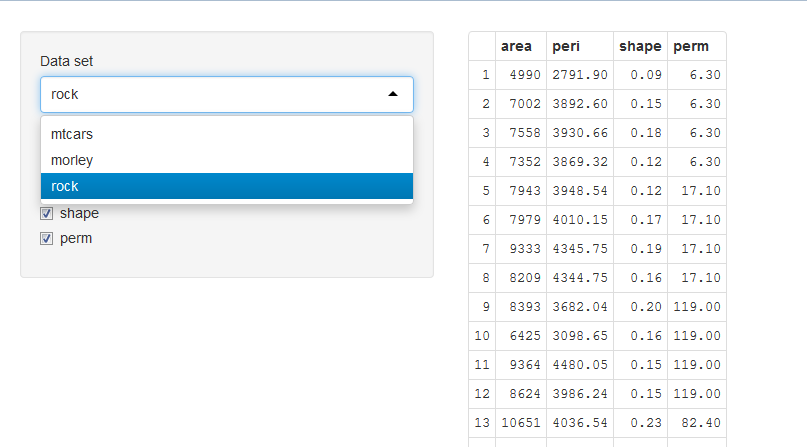

## Intro

This data product is an example in order to learn how use the ShinyApp package
in order to create web data products. The example shows how getting information from
differents R dataset

--- .class #id 

## Shiny components

The example use the following ui controls from the shiny ui library

<ul>
<li>Radiobutton</li>
<li>Dropdown</li>
</ul>

--- .class #id 

## R code sample

The following R code shows how gete the colums name of a dataset shinyapps.io

```r
dat <- get("rock")
colnames <- names(dat)
colnames
```

```
## [1] "area"  "peri"  "shape" "perm"
```


--- .class #id 

## How looks the example



--- .class #id 

## Run the example

Click in the following link in order to run the <a href="https://rruizriol.shinyapps.io/Dataproduct/">example</a>
 

